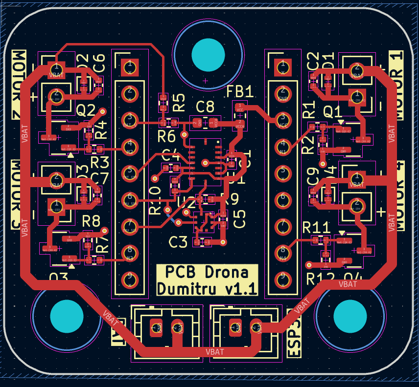
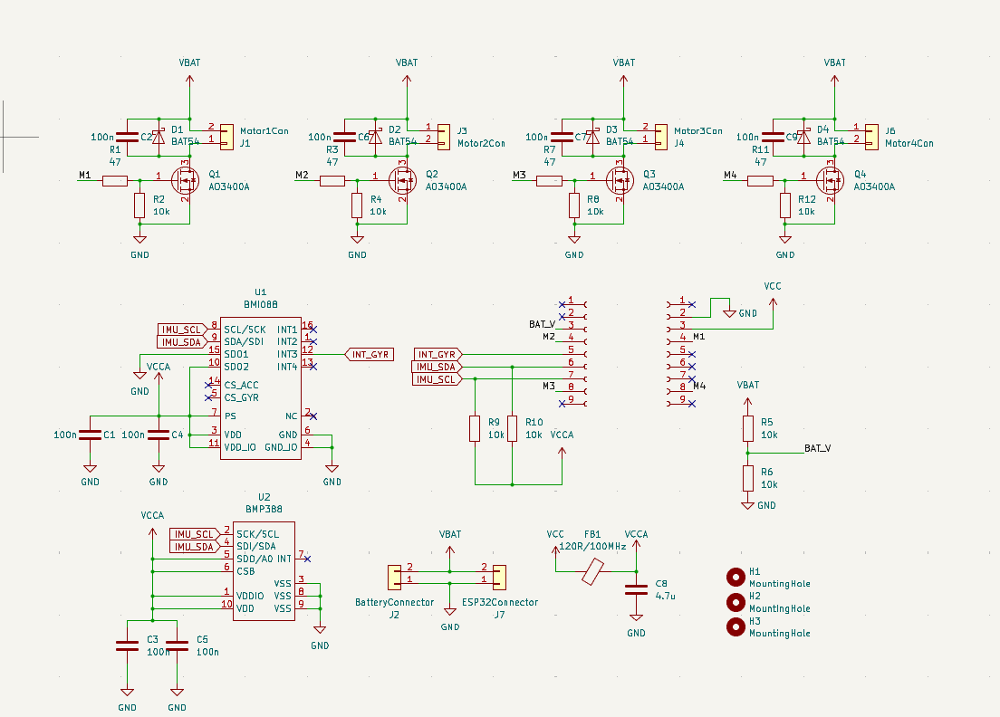

# Drona Quadcopter - Drona Dumitru

## Overview 
A fully custom quadcopter drone featuring custom chassis modelling, PCB design, and PID controller with Kalman filtering.

###  Scope
To design and build a fully functional quadcopter from scratch, integrating hardware and software systems for flight control and telemetry.
Work in progress!

###  Key Features
- Custom PCB shield for sensor integration and motor control
- swappable ESP32 microcontroller breakout-board
- Altimeter, Gyroscope and Accelerometer sensor fusion
- PID controller determined with a mathematical model 
- Remote interface using WIFI for reading telemetry data

---

## 🧱 Project Architecture

### 📊 System Block Diagram

### 🧩 Component Overview
- Flight Control Board (PCB)
- 3D printed PETG frame
- 3.7v 300 mAh LiPo Battery for power delivery
- Altimeter (BMP388 Pressure Sensor), BMI088 (IMU for Accelerometer and Gyroscope data)
- Communication using Wi-Fi  

---

## ⚙️ Hardware Design

### PCB Design

- **Tools Used:** Kicad 9.0
- **Schematic Overview:** 

  The purpose of this component is to integrate the motor amplifier circuits and the sensors all in one compact board. 
  
- **Features:**
  - Sensor integration using I2C for the IMU and pressure sensor
  - Motor control circuitry using N-channel mosfets
  - Power management 

- **Labels:**
  - BAT_V - 3.7v from battery
  - VCC - 3.3v from ESP32
  - M1-4 - motor PWM signal
  - IMU_SDA/SCL - I2C communication line
  - IMU_INT - interrupt pin for sensors

  - "BAT" JST Connector - used for connecting the PCB to the battery power.
  - "ESP32" JST Connector - used for connecting the ESP32 to battery power via the battery pins on the back of the board.
  - MOTOR 1-4 through hole connectors - used for wiring the motors to the PCB.

#### Fabrication Notes
- 2 Layer PCB
- 35 x 39 mm size  
- Produced by JLCPCB in China
---

### Chassis / Frame Design
- **Design Software:** Inventor
- **Materials:** PETG filament
- **Dimensions & Weight:** *(Specify here)*   
- **Mounting Points:** friction fits for the motors and PCB to avoid using screws

---

## Software  -- WIP

## 👥 Contributors
| Name | Role |
|--------------------|----------|
| Groza Mihai Roland |  |
| Dumitru Stefan Mihnea |  |

--
