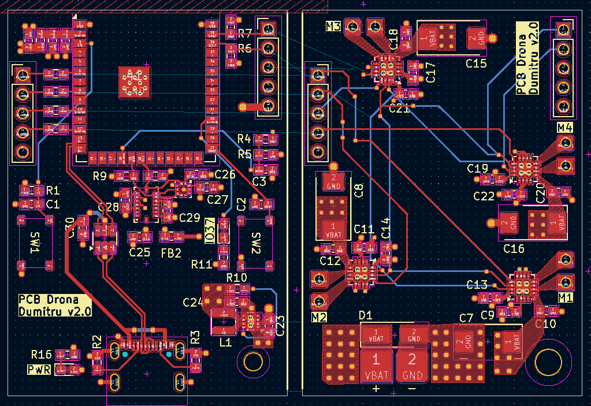
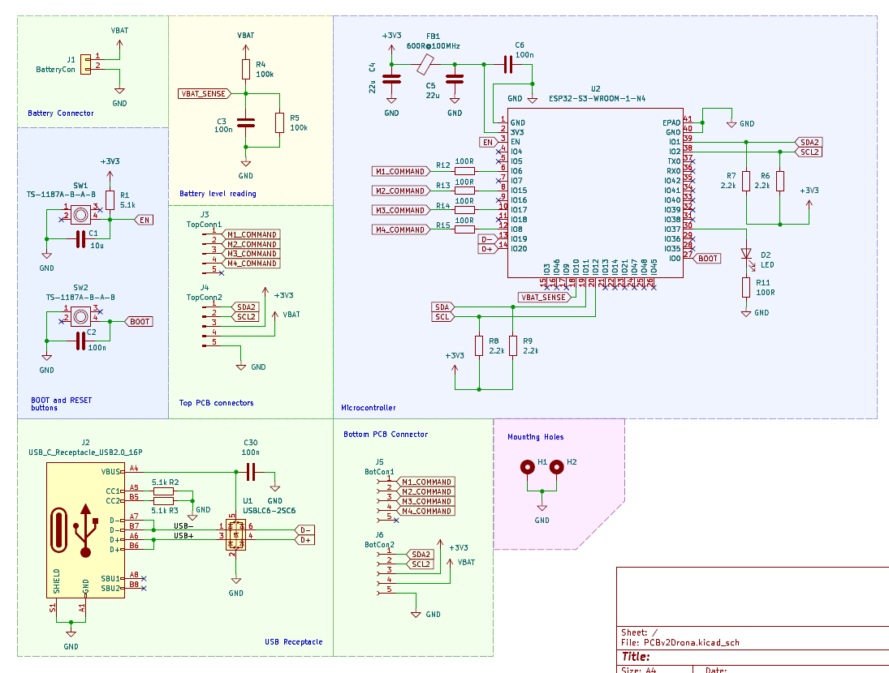
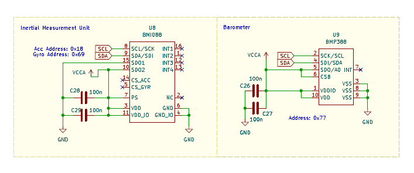
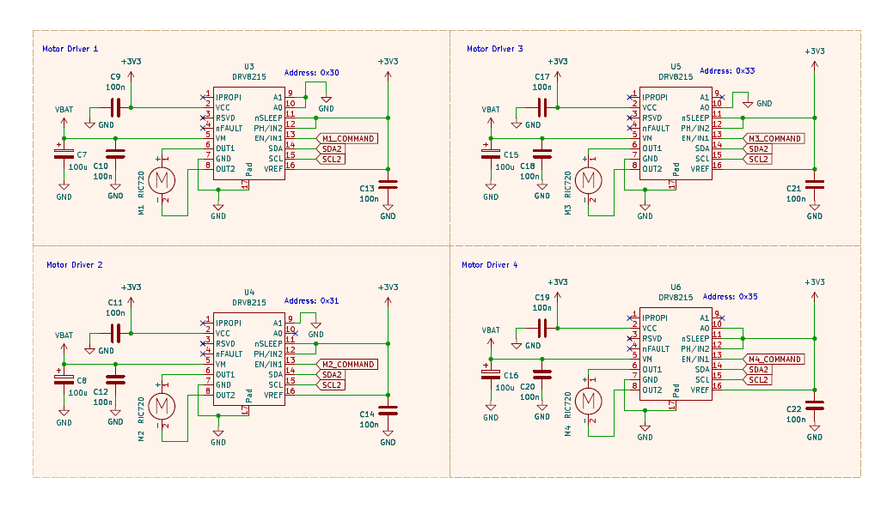
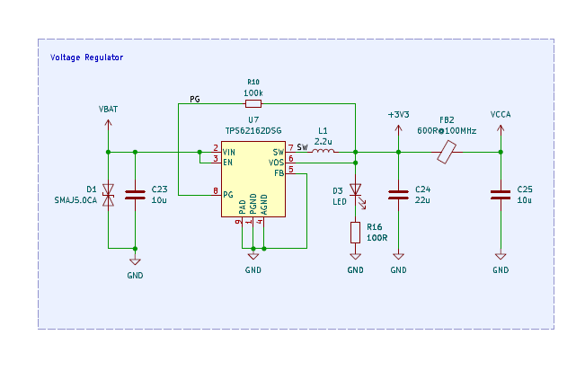

# Drona Quadcopter - Drona Dumitru

## Overview 
A fully custom quadcopter drone featuring custom chassis modelling, PCB design, and PID controller with Kalman filtering.

###  Scope
To design and build a fully functional quadcopter from scratch, integrating hardware and software systems for flight control and telemetry.
Work in progress!

###  Key Features
- Custom PCBs for microcontroller, sensor integration and motor control
- Altimeter, Gyroscope and Accelerometer sensor fusion
- PID controller determined with a mathematical model 
- Remote interface using WIFI for reading telemetry data

---

## 🧱 Project Architecture

### 📊 System Block Diagram

### 🧩 Component Overview
- Flight Control Board (PCB)
- Motor driver Board (PCB)
- 3D printed PETG frame
- 3.7v 400 mAh LiPo Battery for power delivery
- Altimeter (BMP388 Pressure Sensor), BMI088 (IMU for Accelerometer and Gyroscope data)
- DRV8215 H-bridge motor drivers with current sensing, OVP and OCP
- Communication using Wi-Fi  

---

## ⚙️ Hardware Design

### PCB Design

- **Tools Used:** Kicad 9.0
- **Schematic Overview:** 

  The purpose of this component is to integrate the motor amplifier circuits and the sensors all in one compact board. 
  
- **Features:**
  - 32 bit dual core microcontroller with WIFI antenna and USB programming
  - Sensor integration using I2C for the IMU and pressure sensor
  - Motor control circuitry using I2C programmed H bridge drivers
  - Power regulation and overvoltage protection 
  

#### Fabrication Notes
- 4 Layer PCB
- 2 37 x 51 mm PCBs stacked on top of eachother 
---

### Chassis / Frame Design
- **Design Software:** Inventor
- **Materials:** PETG filament
- **Dimensions & Weight:** *(Specify here)*   
- **Mounting Points:** friction fits for the motors and PCB to avoid using screws

---

## Software  -- WIP

## 👥 Contributors
| Name | Role |
|--------------------|----------|
| Groza Mihai Roland | PCB and chassis design |
| Dumitru Stefan Mihnea | Drone programming and control |

--
